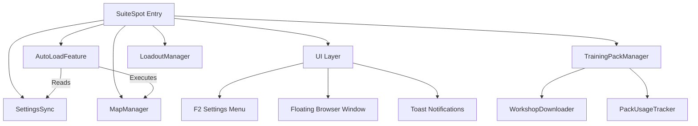

# SuiteSpot Architecture & Technical Reference

## Project Context
*   **Type:** BakkesMod Plugin (C++ Dynamic Link Library)
*   **Platform:** Windows x64 (Rocket League requirement)
*   **Language:** C++20
*   **Dependencies:**
    *   **BakkesMod SDK:** Core game hooks and wrappers.
    *   **ImGui:** User interface (DirectX 11 backend).
    *   **nlohmann/json:** Configuration and data persistence.
    *   **PowerShell:** Used for some file operations (unzipping, versioning).

## Architecture

The project follows a "Hub and Spoke" architecture where `SuiteSpot.cpp` manages the plugin lifecycle and delegates functionality to specialized managers.



## Technical Implementation Details

### 1. Data Structures (`MapList.h`)
The plugin manages three distinct types of content:
*   **Standard Maps (`MapEntry`):** Simple code/name pairs.
*   **Training Packs (`TrainingEntry`):** Rich metadata including:
    *   `code`: The 16-character share code.
    *   `difficulty`(least >> most): Unranked >> Bronze >> Silver >> Gold >> Platinum >> Diamond >> Champion >> Grand Champion >> Supersonic Legend.
    *   `tags`: Vector of descriptive tags (e.g., "Air Dribble", "Defense").
    *   `videoUrl`: Optional YouTube preview link (broken and needs fixed).
    *   `source`: Tracks origin ("prejump" for scraped, "custom" for user-added).
*   **Workshop Maps (`WorkshopEntry`):** Local file pointers to `.udk` files with metadata parsed from JSON or folder names.

### 2. Auto-Load Logic (`AutoLoadFeature.cpp`)
This is the core automation engine.
*   **Trigger:** `OnMatchEnded` event hook.
*   **Logic:**
    1.  Checks `SettingsSync` for the preferred mode (Freeplay, Training, Workshop).
    2.  Resolves the specific map/pack code.
    3.  **Delays:** Uses `gameWrapper->SetTimeout()` to schedule the load command (e.g., `load_freeplay`). This is critical because immediate loading can crash the game during the match-end sequence.
    4.  **Queuing:** If "Auto-Queue" is enabled, it triggers the queue command after a configured delay.

### 3. Training Pack Management (`TrainingPackManager`)
*   **Persistence:** Packs are stored in `%APPDATA%\bakkesmod\bakkesmod\data\SuiteSpot\TrainingSuite\training_packs.json`.
*   **Data Source:** `UpdateTrainingPackList` writes a temporary PowerShell script (`SuitePackGrabber_temp.ps1`) to the system temp directory, executes it via `cmd.exe`, and captures output to update the local cache.
*   **Filtering:** Implements robust searching by Name, Code, Tags, Difficulty, and Video availability.
*   **Usage Tracking:** `PackUsageTracker.cpp` serializes user history (`loadCount`, `lastLoadedTimestamp`) to `training_usage.json`, enabling "Favorites" sorting.

### 4. Workshop Integration (`WorkshopDownloader` & `MapManager`)
*   **Discovery:** Scans configured directories recursively for `.udk` or `.upk` files.
*   **Downloading:**
    *   **API:** Queries `https://celab.jetfox.ovh/api/v4/projects/` for map data and releases.
    *   **Extraction:** Uses `system("powershell.exe Expand-Archive ...")` to unzip downloaded maps. This is a point of fragility if PowerShell execution policies are restrictive.
    *   **Safety:** Downloads images directly to local storage to avoid game-thread blocking.

### 5. Settings & Synchronization (`SettingsSync`)
*   **CVar Backing:** All settings are backed by BakkesMod's `CVarManager`.
*   **Callback Pattern:** Uses `.addOnValueChanged([this](...) { ... })` to immediately sync CVar changes to local member variables, ensuring extremely fast read access during the render loop.
*   **Naming:** All CVars are prefixed with `suitespot_` (e.g., `suitespot_enabled`, `suitespot_delay_queue`).

### 6. User Interface (`UI Layer`)
*   **Framework:** ImGui (Immediate Mode GUI).
*   **Training Pack Browser:**
    *   **Virtual Scrolling:** Uses `ImGuiListClipper` (implied pattern for large lists) to render only visible items from the 2000+ pack database.
    *   **Sorting:** Clickable column headers (`SortableColumnHeader`) toggle between Ascending/Descending.
    *   **Drag & Drop:** Supports dragging packs from the browser to "Quick Pick" slots.

```